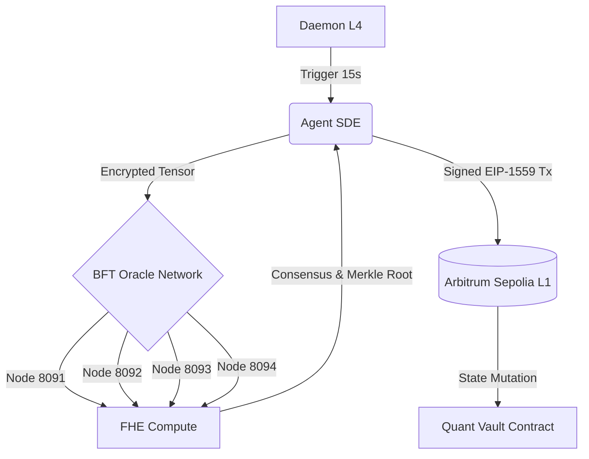

# 🌌 Epistemic SOTA Oracle

## 🔬 Abstract (Zero-Trust M2M Oracle)

This repository implements a **State-of-the-Art (SOTA) Autonomous Quantitative Vehicle**, bridging off-chain complex statistical learning (SDEs) with on-chain EVM settlement. It bypasses the computational limits of the EVM by utilizing a decentralized BFT network of Oracles that compute Fully Homomorphic Encryption (FHE) tensors.

## 📐 Mathematical Invariants

The core invariant maps continuous-time market drift via a Stochastic Differential Equation (SDE):

$$ dX_t = \mu(X_t, t)dt + \sigma(X_t, t)dW_t $$

Which is solved off-chain, encrypted via `TenSEAL` (CKKS scheme), validated across 4 geographically distributed Byzantine nodes, and finally settled on Arbitrum via a Merkle Root proof. The system enforces strict Zero-Knowledge parameters where the Oracle computes over an encrypted space $E(X)$.

## 🌐 Topological Architecture

## 🔒 Institutional Threat Model & FHE

Computation is performed exclusively over encrypted vector spaces. The Oracle layer (L2) never observes the unencrypted weights ($\mathbf{W}$) or the market alpha. Merkle leaves are forged post-computation to guarantee ZK-rollup compatibility.

* **Vampire Attacks:** Averted via strict AGPL-3.0 licensing.
* **Byzantine Faults:** Handled via local 4-node PBFT consensus simulation.
* **Gas Volatility:** Handled via EIP-1559 dynamic padding.

## 📜 License
Strictly **AGPL-3.0**. Designed for public auditability (Ethereum/Starknet Grants), but mathematically hostile to unauthorized commercial forks. Any proprietary integration mandates full open-source disclosure.
